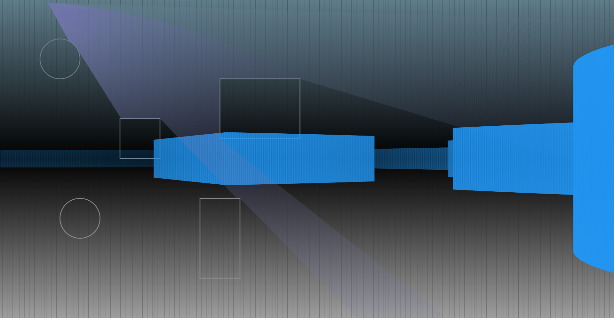
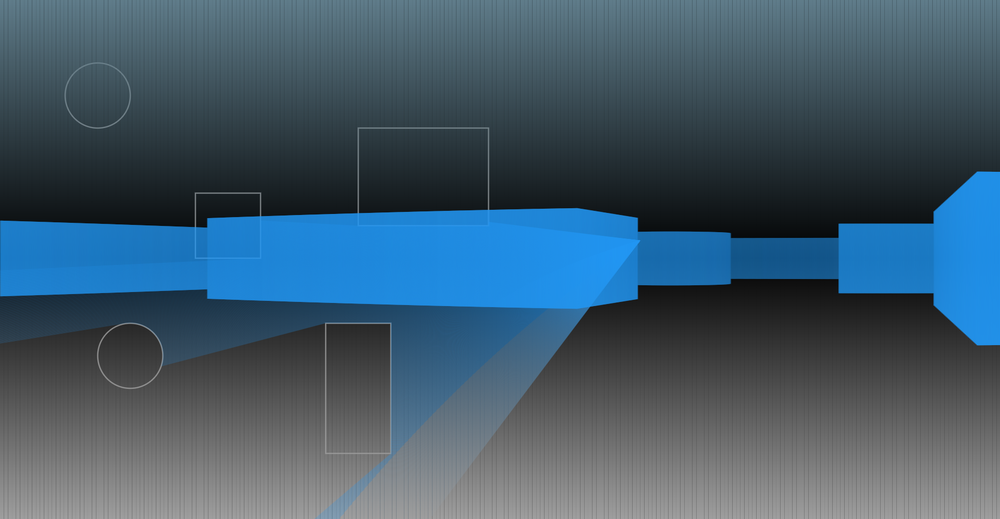

# Raycasting renderer on Flame engine with Flutter

It is an experiment to try get out of bounds of FLutter 2d possibilities.

I've created simple 2.5d raycasting renderer on Flame.

It's just a very raw demo with no decomposition and refactoring now.

In future i think i can finish it to create reusable renderer to create DOOM-like games on Flame.

Raycasting is very expensive, especially on Flame engine, which is not too powerful for this.

